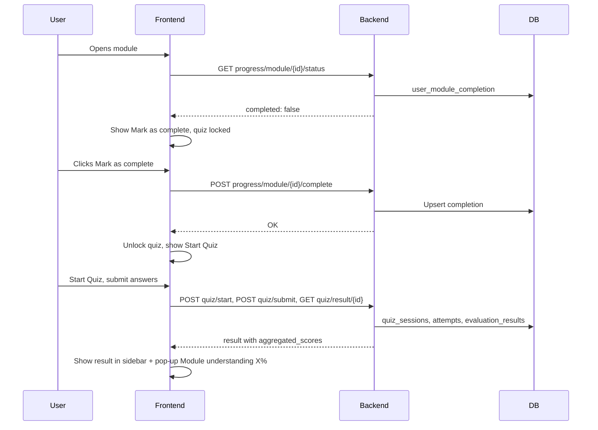

# Plan: Module Completion, Quiz Unlock, and Module/Course Understanding Scores

## Goal

1. **Module completion**: User explicitly marks a module as complete (button). No auto-detect from scroll.
2. **Quiz unlock**: Quiz for a module is only available after the user marks that module as complete.
3. **Module understanding score**: After the user completes the module quiz, generate and show a score = "how much understanding does the user have for this module?" (we already have this from quiz result: composite + breakdown).
4. **Show score in pop-up**: After quiz result loads, show a pop-up on the frontend: "Your understanding of this module: X%" (and optionally breakdown).
5. **Course-level understanding (optional)**: Aggregate module scores to show "how much understanding for the whole course?" (e.g. average of all module scores for that course).

---

## Current State

- **Quiz**: One quiz per **module** (not per sub-topic). Questions are selected from the question bank for that `module_id`. Evaluation uses module context + question + rubric + user answer → Gemini → scores. Already implemented.
- **Result**: `GET /quiz/result/{quiz_session_id}` returns `aggregated_scores` (composite, correctness, conceptual_depth, reasoning_quality, confidence_alignment), strengths, weak_areas. Frontend shows this in the sidebar after quiz.
- **No module completion**: Backend does not track "user marked module X as complete."
- **No quiz gating**: Frontend currently shows "Start Quiz" always (no unlock logic).
- **No post-quiz pop-up**: Result is only in the sidebar; no modal saying "Your module understanding: X%."
- **QuizSession.completed_at**: Exists in DB but is never set when the user finishes the quiz.

---

## Backend Changes

### 1. Module completion table and API

- **New table**: `user_module_completion`
  - `user_id` (Integer, FK to users)
  - `module_id` (UUID)
  - `completed_at` (TIMESTAMP with timezone)
  - Primary key: (user_id, module_id) or add an `id` and unique (user_id, module_id).
- **New endpoints** (e.g. under a `progress` or `completion` engine, or under existing router):
  - `POST /progress/module/{module_id}/complete`  
    - Auth required.  
    - Upsert: set completed_at = now for (user_id, module_id).  
    - Returns e.g. `{ "module_id": "...", "completed_at": "..." }`.
  - `GET /progress/module/{module_id}/status` (or `GET /progress/completion` with query `?module_id=`)  
    - Auth required.  
    - Returns whether this user has completed this module: e.g. `{ "module_id": "...", "completed": true, "completed_at": "..." }`.

### 2. Module understanding score (from quiz)

- **Option A – Derive from existing data (recommended for first version)**  
  - When the user finishes a quiz, we already have the result in `quiz_sessions` + `evaluation_results`.  
  - Add endpoint: `GET /progress/module/{module_id}/understanding`  
    - Auth required.  
    - Find the **latest** quiz session for (user_id, module_id) that has all attempts evaluated (or use last submitted quiz).  
    - Call same aggregation as `get_quiz_result` for that session and return:  
      `{ "module_id": "...", "composite": 0.85, "correctness": ..., "conceptual_depth": ..., "reasoning_quality": ..., "confidence_alignment": ..., "quiz_session_id": "..." }`.  
    - If no such session, return 404 or `{ "module_id": "...", "composite": null }`.
  - No new table; single source of truth = quiz data.
- **Option B – Snapshot table**  
  - On quiz completion (when we have the result), insert into `user_module_score` (user_id, module_id, composite, correctness, conceptual_depth, reasoning_quality, confidence_alignment, quiz_session_id, completed_at).  
  - Then `GET /progress/module/{module_id}/understanding` reads from this table (latest row per user+module).  
  - Use if you want to store "best attempt" or multiple snapshots later.

Recommendation: Start with **Option A**. Add Option B later if you need history or faster reads.

### 3. Set QuizSession.completed_at

- When the user submits the **last** answer and we fetch the result (in `submit_answer` flow), set `session.completed_at = now()` and commit.  
- This makes "latest completed quiz for user+module" well-defined for the understanding endpoint.

### 4. Course-level score (optional, later)

- Backend does not have a "course" entity; course = list of module_ids (from frontend outline).  
- **Option 1**: Frontend calls `GET /progress/module/{module_id}/understanding` for each module in the course and computes course average (or weighted average) and shows "Course understanding: X%."  
- **Option 2**: Backend endpoint `GET /progress/course/understanding?module_ids=id1,id2,...` that returns scores for those modules and optionally an aggregate.  
- Either way, "course understanding" = function of module-level scores for that course’s modules.

---

## Frontend Changes

### 1. Mark module as complete

- Add a **"Mark as complete"** button (e.g. at the bottom of the module content or in the right sidebar above the quiz card).  
- On click: call `POST /progress/module/{module_id}/complete`.  
- On success: set local state (e.g. `moduleCompleted = true`) and unlock the quiz section (see below).  
- Optionally show a short confirmation: "Module marked as complete. Quiz unlocked."

### 2. Quiz unlock

- On module page load, call `GET /progress/module/{module_id}/status`.  
- If `completed === true`: show the existing **"Start Quiz"** button and quiz UI as today.  
- If `completed === false`:  
  - Do **not** show "Start Quiz" yet.  
  - Show message: "Mark this module as complete to unlock the quiz."  
  - Show **"Mark as complete"** button; when clicked and API succeeds, set `moduleCompleted = true` and show "Start Quiz."

### 3. Pop-up after quiz result

- When `quizStatus === 'result'` and `quizResult` is loaded, **in addition** to showing the result in the sidebar:  
  - Open a **modal/pop-up** that says something like:  
    - **"Your understanding of this module: X%"** (use `quizResult.aggregated_scores.composite * 100`).  
    - Optionally: short breakdown (Correctness, Conceptual depth, Reasoning, Confidence alignment) and "Strengths" / "Areas to improve."  
  - Button: "Done" or "Close" to dismiss the modal.  
- This gives the user a clear, one-time summary that "this is your module understanding score."

### 4. Sidebar / outline (optional)

- In the left sidebar (course outline), for each module that the user has completed (and has a quiz score), show a small indicator: e.g. green check, or "X% understanding."  
- Requires: either `GET /progress/module/{module_id}/status` and `GET /progress/module/{module_id}/understanding` per module, or a single `GET /progress/summary?module_ids=...` that returns completion + understanding for many modules at once (to avoid N requests).

---

## Data flow (summary)

---

## Implementation order

1. **Backend**: Add `user_module_completion` table (migration), `POST .../complete`, `GET .../status`.  
2. **Backend**: Set `QuizSession.completed_at` when last answer is submitted and result is fetched.  
3. **Backend**: Add `GET /progress/module/{module_id}/understanding` (derive from latest completed quiz for user+module).  
4. **Frontend**: Fetch completion status on module load; show "Mark as complete" and lock quiz until complete.  
5. **Frontend**: After quiz result loads, show modal with "Your understanding of this module: X%."  
6. (Later) Course-level score and sidebar indicators as needed.

---

## Files to add/change (concise)

**Backend**

- New migration: table `user_module_completion` (user_id, module_id, completed_at).
- New engine or router: e.g. `engines/progress/` with `router.py`, `service.py`, `schemas.py` for completion and understanding.
- `main.py`: Include progress router.
- `engines/quiz_engine/service.py`: In `submit_answer`, when last question is submitted and we are about to return success, set `QuizSession.completed_at` for that session (and commit).

**Frontend**

- `api.ts`: Add `markModuleComplete(moduleId)`, `getModuleCompletionStatus(moduleId)`, `getModuleUnderstanding(moduleId)`.
- `ModuleDetailScreen.tsx`:  
  - State: `moduleCompleted`, `moduleUnderstanding`.  
  - On load: fetch completion status; if not completed, show "Mark as complete" and lock quiz.  
  - On "Mark as complete": call API, then set `moduleCompleted = true`.  
  - When `quizStatus === 'result'` and `quizResult`: show modal with module understanding (composite % and optional breakdown).  
- Optional: Modal component or inline modal in `ModuleDetailScreen` + CSS.

---

## Summary

| What | How |
|------|-----|
| Know if user completed module | User clicks "Mark as complete" → backend stores in `user_module_completion`. |
| Unlock quiz | Frontend checks completion status; only show "Start Quiz" when completed. |
| Module understanding score | From latest quiz result for that user+module (aggregated_scores.composite). Backend endpoint to return it; frontend shows in pop-up after quiz. |
| Course understanding | Later: average (or similar) of module understanding scores for modules in that course; frontend or backend can compute. |
| Pop-up | When quiz result is loaded, open modal: "Your understanding of this module: X%." |

No change to the evaluation pipeline (context + question + user answer → Gemini → scores); we only add completion tracking, quiz gating, and exposure of the existing quiz result as "module understanding" with a clear UX (button + pop-up).
